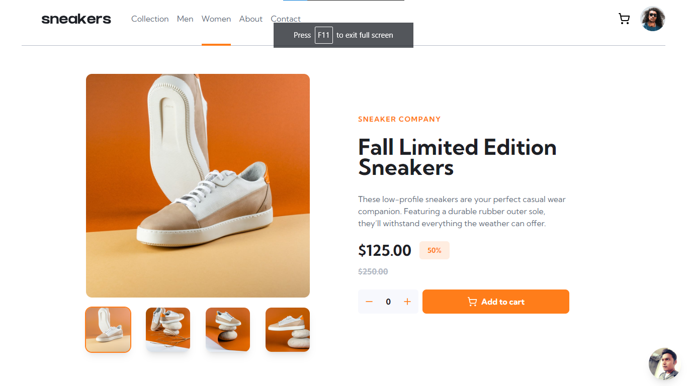
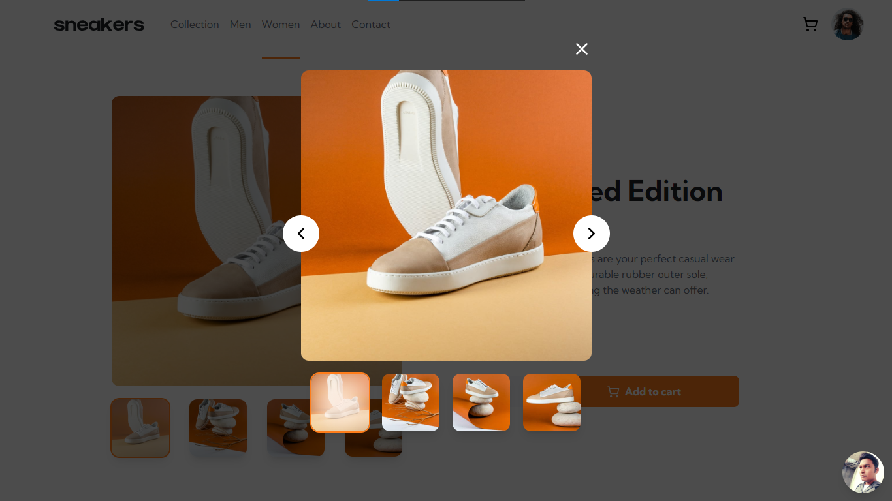

# Frontend Mentor - E-commerce product page solution

This is a solution to the [E-commerce product page challenge on Frontend Mentor](https://www.frontendmentor.io/challenges/ecommerce-product-page-UPsZ9MJp6). Frontend Mentor challenges help you improve your coding skills by building realistic projects.

## Table of contents

- [Frontend Mentor - E-commerce product page solution](#frontend-mentor---e-commerce-product-page-solution)
  - [Table of contents](#table-of-contents)
  - [Overview](#overview)
    - [The challenge](#the-challenge)
    - [Screenshot](#screenshot)
    - [Links](#links)
  - [My process](#my-process)
    - [Built with](#built-with)
    - [What I learned](#what-i-learned)
  - [Author](#author)

  
## Overview

### The challenge

Users should be able to:

- View the optimal layout for the site depending on their device's screen size
- See hover states for all interactive elements on the page
- Open a lightbox gallery by clicking on the large product image
- Switch the large product image by clicking on the small thumbnail images
- Add items to the cart
- View the cart and remove items from it

### Screenshot




### Links

- Solution URL: [Frontend Mentor Solution URL](https://www.frontendmentor.io/solutions/product-landing-page-using-react-js-context-api-tailwind-css-4pssbWUEdj)
- Live Site URL: [Live URL](https://e-commerce-product-page-app.vercel.app/)

## My process

### Built with

- Semantic HTML5 markup
- Tailwind CSS
- Flexbox
- Mobile-first workflow
- [React](https://reactjs.org/) - JS library
- [Framer Motion](https://www.framer.com/) - Animation Library


### What I learned

Learned how to build a custom lightbox gallery using framer motion and Reusable components.

```LightBox Component JSX
const LightBox = ({ setIsClicked, isProduct }) => {
  const [imgIndex, setImgIndex] = useState(isProduct);
  const [direction, setDirection] = useState("");

  const productImages = [
    productOneImg,
    productTwoImg,
    productThreeImg,
    productFourImg,
  ];

  const thumbsArray = [
    productOneThumb,
    productTwoThumb,
    productThreeThumb,
    productFourThumb,
  ];

  const handleNext = () => {
    setImgIndex((prevState) =>
      prevState + 1 === productImages.length ? 0 : prevState + 1
    );
    setDirection("right");
  };

  const handlePrevious = () => {
    setImgIndex((prevState) =>
      prevState - 1 < 0 ? productImages.length - 1 : prevState - 1
    );
    setDirection("left");
  };

  return (
    <motion.div
      variants={fadeAnimation}
      initial="hidden"
      animate="show"
      exit="exit"
      className="fixed w-full h-screen top-0 left-0 bg-black-color/70 flex items-center justify-center flex-col"
      onClick={() => setIsClicked((prevState) => !prevState)}
    >
      <div className="relative" onClick={(e) => e.stopPropagation()}>
        <AnimatePresence mode="wait" initial={false}>
          <motion.div
            key={imgIndex}
            className="overflow-hidden w-[445px] flex rounded-xl"
          >
            <motion.img
              drag="x"
              dragConstraints={{ left: 0, right: 0 }}
              dragElastic={1}
              variants={silderVariants}
              initial={direction === "right" ? "hiddenRight" : "hiddenLeft"}
              exit="exit"
              animate="show"
              src={productImages[imgIndex]}
              alt="shoe"
              className="w-full h-[445px] object-cover cursor-pointer"
            />
          </motion.div>
        </AnimatePresence>

        <div
          className="bg-white-color w-14 h-14 flex justify-center items-center p-3 rounded-full absolute top-2/4 -left-7 z-40 cursor-pointer"
          onClick={handlePrevious}
        >
          <ChevronLeft size={30} className="hover:text-primary-orange" />
        </div>
        <div
          className="bg-white-color w-14 h-14 flex justify-center items-center p-3 rounded-full absolute top-2/4 -right-7 cursor-pointer"
          onClick={handleNext}
        >
          <ChevronRight size={30} className="hover:text-primary-orange" />
        </div>
        <div
          className="absolute -top-12 right-0"
          onClick={() => setIsClicked((prevState) => !prevState)}
        >
          <X
            size={30}
            className="text-white-color cursor-pointer hover:text-primary-orange"
          />
        </div>
      </div>

      <div
        className="flex items-center justify-between gap-5 mt-5"
        onClick={(e) => e.stopPropagation()}
      >
        {thumbsArray.map((thumb, index) => (
          <div
            key={index}
            onClick={() => setImgIndex(index)}
            className={`${
              imgIndex === index ? "ring-2 ring-primary-orange" : ""
            } overflow-hidden shadow-lg rounded-xl relative z-50 cursor-pointer`}
          >
            

            <AnimatePresence mode="wait" initial={false}>
              <motion.div
                variants={thumbVariants}
                initial="hidden"
                animate="show"
                exit="exit"
                key={imgIndex}
                className={`absolute top-0 left-0 w-0 z-10 h-full ${
                  imgIndex === index ? "bg-primary-pale-orange blur-xl" : ""
                }`}
              ></motion.div>
            </AnimatePresence>
          </div>
        ))}
      </div>
    </motion.div>
  );
};
```

## Author

- Frontend Mentor - [@pritamtirpude](https://www.frontendmentor.io/profile/pritamtirpude)
- Twitter - [@ptirpude1991](https://twitter.com/ptirpude1991)


